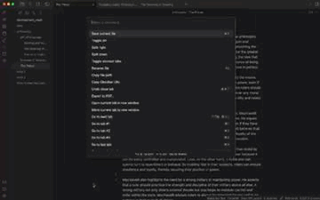
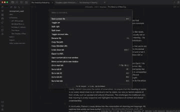
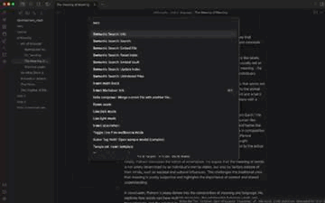

# Obsidian Semantic Search

Simple interface for semantic search over markdown files in an Obsidian vault. The project is experimental and a work in progress. A longer description of the implementation can be found [here](https://jwplatta.github.io/posts/semantic-search-for-obsidian/).

## Install & Start Server

The plugin is not available in the community plugins. To install the plugin, clone the repository and run the `install.py` script to install the plugin in Obsidian. This will ask you for the full path to your Obsidian vault.

The current design requires a server to be running to handle the search requests. The server is a simple node app that implements an express server. You can run the server in the background using `npm run prod` and stop it with `npm run stop-prod`. The server is available on port 3003.

```bash
$ cd obsidian-semantic-search/server
$ npm install
$ npm run prod
```

## Usage

Currently there's seven commands in the plugin interface: Info, Unindexed Files, Seach, Embed File, Reset Index, Embed Vault, Update Index:
- **Info** displays the number of files embedded.
- **Unindexed Files** returns the names of the files that have not been embedded.
- **Search** semantically search for terms and expression in the vualt.
- **Embed File** add embedding for the currently open file to the vector datastore.
- **Reset Index** removes all the embeddings from the vector datastore.
- **Embed Vault** adds all the markdown files in the vault to the vector datastore.
- **Update Index** updates embedding index for vector datastore.

Before your first search, use the **Embed Vault** command to add all the files in the vault to the vector datastore. Then use the **Update Index** command to update the embedding index for the vector datastore.

### Embedding a Single File

<p align="center">
  
</p>

### Embedding the Entire Vault

<p align="center">
  
</p>

### Searching

<p align="center">
  
</p>